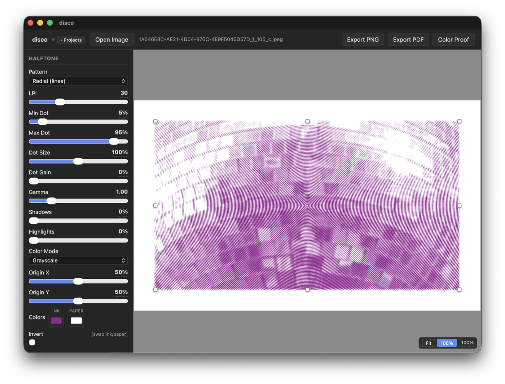

# Halftones

A native macOS app (and browser tool) for halftone image processing aimed at screen printing. Drop in a photo, choose a pattern, adjust settings, and export print-ready files. Built with Claude for my own purposes, but perhaps it's useful to you as well.



## Features

### Halftone Patterns
13 patterns: dot, euclidean dot, ellipse, diamond, hexagonal, line, crosshatch, concentric, brick, radial dots, radial lines, stochastic (FM dither), and Poisson-disk stipple.

### Color Modes
- **Grayscale** — single halftone layer with ink/paper color preview
- **CMYK** — four-channel process separation with per-channel angle/LPI and composite preview
- **Spot Color** — LAB k-means palette extraction, per-color flat or halftone rendering, and a **key plate** (halftone of the full image overprinted on top of all color layers for tonal depth)

### Dot & Tone Controls
- Min/max dot, dot gain compensation, dot size multiplier
- **Gamma** — power curve over the full tonal range
- **Shadows / Highlights** — independent piecewise boost for each half of the tonal range
- Invert (swap ink/paper)

### Image Transforms
Crop, rotation, levels (black/white point + midtone gamma). All applied before halftoning.

### Export
- **PNG** — full-resolution with embedded DPI metadata
- **Channel PNGs** — one black-on-white plate per channel (CMYK or spot), including key plate
- **PDF** — multi-page with crop marks, optional margin, optional alignment marks (crosshair + circle at each side midpoint for multi-layer registration)
- **Color Proof** — WYSIWYG composite of all layers in their actual ink colors
- Vector PDF paths for dot, hex, ellipse, diamond, line, euclidean, and radial-line patterns

### Other
- Adjustable margin; crop marks and alignment marks in the waste strip (removed on trim)
- Pan/zoom viewport with Fit and 100% (output-accurate) presets
- Transparent PNG source: transparent areas produce no ink on any plate
- Project persistence: named projects with auto-save; `.halftones` file format (zip of JSON + source image)

## Download

**[Download for macOS (Apple Silicon)](https://github.com/schwanksta/Halftones/releases/latest)** — unsigned app; on first launch right-click → Open, or go to System Settings → Privacy & Security → Open Anyway.

## Getting Started

```bash
npm install
npm run dev        # browser dev server at localhost:5173
npm run tauri:dev  # native macOS window
```

Drop an image onto the canvas or use the file picker.

## Building

```bash
npm run build        # typecheck + Vite bundle
npm run tauri:build  # Halftones.app + .dmg → src-tauri/target/release/bundle/
```

## Tech

React 18 + TypeScript + Vite + Tauri 2. No backend. Rendering is canvas/WebGL2 (GPU fast path for common patterns with CPU fallback) + jsPDF for PDF export. Path2D batching and grayscale pre-computation keep the preview loop fast.

Currently built and tested on macOS only. Tauri 2 supports Windows and Linux and the codebase has no meaningful platform-specific code, so builds for other targets should be straightforward — mainly a matter of adjusting the bundle targets in `tauri.conf.json` and restructuring the app menu.

## License

MIT
