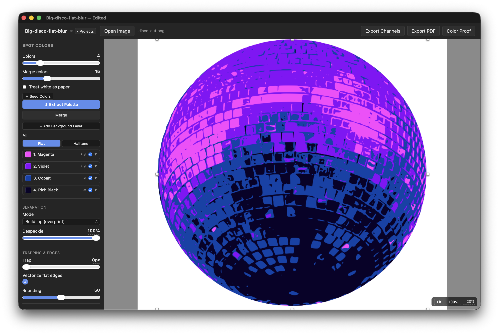
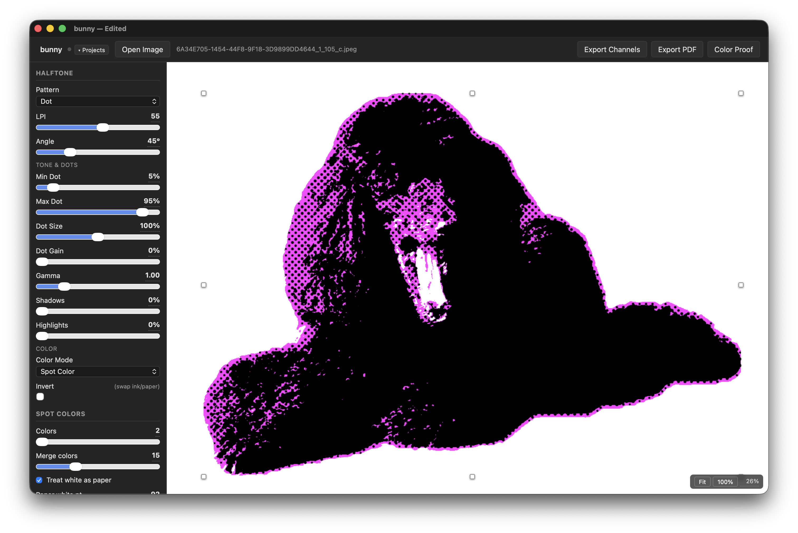
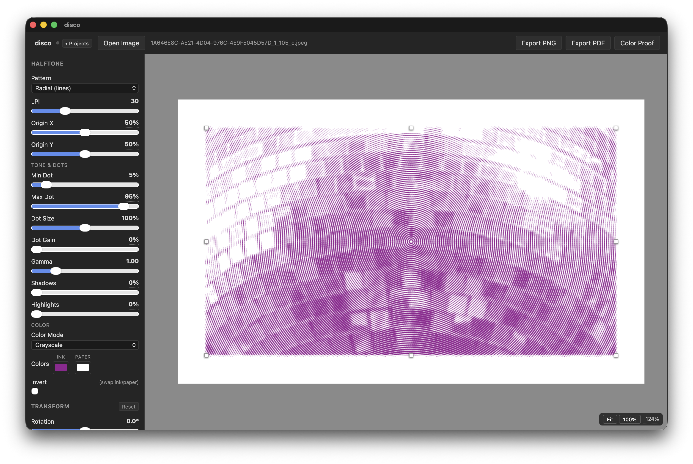

# Halftones

A native macOS app (or browser-based app) for halftone image processing and spot color separation aimed at artists who screen print. Drop in an image, choose a pattern, adjust settings, and export print-ready files and color proofs. Halftones allows you to experiment with many different options, mixing and matching color separation layers and halftones in different ways.

There are three modes: 
* Grayscale / halftone, with a single halftone pattern.
* Color separation (which can include halftoned layers or a halftoned key plate)
* CMYK. 

Built with Claude for my own purposes, but perhaps it's useful to you as well.





## Features

### Halftone Patterns
13 patterns: dot, euclidean dot, ellipse, diamond, hexagonal, line, crosshatch, concentric, brick, radial dots, radial lines, stochastic (FM dither), and Poisson-disk stipple.

### Color Modes
- **Grayscale** — single halftone layer with ink/paper color preview
- **CMYK** — four-channel process separation with per-channel angle/LPI and composite preview
- **Spot Color** — LAB k-means palette extraction, per-color flat or halftone rendering, click-to-seed palette colors from the image, per-color and global trap, and a **key plate** (halftone of the full image overprinted on top of all color layers for tonal depth — with optional edge stroke, silhouette outline, a toggle to use the strokes without the halftone dots, and a **merge with darkest color** option to fold the key into the darkest separation plate as one screen instead of a separate overprint)
- **Separation mode** — **knockout** (default: exclusive regions, one ink per pixel) or **build-up** (nested cumulative overprint — each tone inks its plate plus every lighter plate beneath it; registration-forgiving, suited to tonal/duotone palettes)
- **Underbase** — an optional base plate (union of all inked area, choked inward) printed first, e.g. white or silver under the full design
- **Substrate color** — set the paper/garment color the proof and preview composite onto, for previewing ink on colored stock
- **Vectorize flat edges** — optionally trace flat color plates into smooth vector outlines so diagonal/curved color boundaries aren't pixelated (staircased). A global default with a **per-color override** (e.g. smooth the flat masses but leave a fine line/hatch plate crisp) and a **Rounding** amount; applies to flat plates only
- **Despeckle** — jointly cleans up the color separation so adjacent layers never erode apart and leave paper showing through; low values remove stray specks, higher values smooth jagged boundaries
- **Treat white as paper** — reserve near-white as bare paper so every extracted color is a real ink (no wasted white plate) and white areas knock out to paper; turn off for white ink on colored stock
- **Background layer** — for transparent/cutout images, add a color plate covering exactly the transparent area, rendered flat or halftoned, with an adjustable **bleed** (as a percentage of the margin) that extends it out toward the trim edge (clipped at the trim so it never covers the crop marks)
- **Merge plates onto one screen** — per-color (and key-plate) **merge with darkest color**, folding same-ink layers (e.g. a black background + black layer + key) onto a single screen instead of separate overprints
- **Palette library** — save the current inks as a reusable palette and apply it later to recolor your layers in one click (separation untouched). Picked by **swatch preview**, names optional; palettes carry the background ink too. Stored in app prefs, so they're reusable across prints

### Dot & Tone Controls
- Min/max dot, dot gain compensation, dot size multiplier
- **Gamma** — power curve over the full tonal range
- **Shadows / Highlights** — independent piecewise boost for each half of the tonal range
- Invert (swap ink/paper)

### Image Transforms
Crop, rotation, levels (black/white point + midtone gamma), plus pre-processing — **blur** (smooth gradients / suppress source noise), **sharpen** (unsharp mask with adjustable radius, so detail holds through the screen), and **noise** (film grain to break up banding). All applied before halftoning.

### Layer Mask
Load a mask that clips every plate at once — confine the artwork to a shape, knock out a region, etc.
- **SVG** (preferred — resolution-independent, stays crisp at any output DPI) or raster (PNG/JPG/WebP); always stretched to the image rect
- **white = keep, black = cut**, with automatic use of the image's alpha when present, an **Invert** toggle, and Auto/Alpha/Luminance source modes
- **Stroke** — a keyline tracing the mask boundary in your choice of width/color, exported as its own dedicated plate in spot mode
- Applies in the live preview and every export, and is non-destructive — the full source image is kept for palette extraction

### Export
- **PNG** — full-resolution with embedded DPI metadata
- **Channel PNGs** — one black-on-white plate per channel (CMYK or spot), including key plate, laid out on the full print page (margin, crop marks, alignment marks) just like the PDF
- **PDF** — multi-page with crop marks, optional margin, optional alignment marks (crosshair + circle at each side midpoint for multi-layer registration)
- Spot plates are labelled by **layer number** (One, Two, Three…), staggered across the page so the labels don't overlap when plates are stacked for registration, and clear of the alignment marks
- **Color Proof** — WYSIWYG composite of all layers in their actual ink colors
- Vector PDF paths for dot, hex, ellipse, diamond, line, euclidean, and radial-line patterns

### Print Plan
A live sidebar readout that turns the current job into a screen-room plan, using your shop's screen inventory:
- **How many screens** (= plate count), **which frame size** (smallest that fits the full output page *and* stocks a fine-enough mesh), and a **suggested mesh per plate** (halftone ≈ 4.5× LPI, flat ~230, white underbase = lowest/heaviest)
- **Min Dot vs mesh** warning when a halftone's highlight dot is too fine to hold on the suggested mesh
- **Gang 2 plates per screen** — pairs plates so consecutive print colors land on different screens (1&3 on one, 2&4 on another), halving the screen count with a wash-and-dry rest between runs
- **Editable shop profile** — your frame sizes, the mesh counts each comes in, and edge clearance; stored in app prefs

### Other
- **Margins** — a single linked margin, or independent **Top/Bottom** and **Sides** values; crop marks and alignment marks live in the waste strip (removed on trim)
- Pan/zoom viewport with Fit and 100% (output-accurate) presets
- Transparent PNG source: transparent areas produce no ink on any plate
- Project persistence: named projects with auto-save; `.halftones` file format (zip of JSON + source image)
- **macOS Share Sheet**: registered as an image opener — share directly from Photos ("Share Subject" etc.) or Finder → Open With → Halftones

## Download

**[Download for macOS (Apple Silicon)](https://github.com/schwanksta/Halftones/releases/latest)** — unsigned app; on first launch right-click → Open, or go to System Settings → Privacy & Security → Open Anyway. If macOS reports the app is "damaged" instead of giving that option, the quarantine flag set by your browser is the cause — clear it with `xattr -cr /Applications/Halftones.app` in Terminal, then open normally.

## Getting Started

```bash
npm install
npm run dev        # browser dev server at localhost:5173
npm run tauri:dev  # native macOS window
```

Drop an image onto the canvas or use the file picker.

## Building

```bash
npm run build        # typecheck + Vite bundle
npm run tauri:build  # Halftones.app + .dmg → src-tauri/target/release/bundle/
```

## Tech

React 18 + TypeScript + Vite + Tauri 2. No backend. Rendering is canvas/WebGL2 (GPU fast path for common patterns with CPU fallback) + jsPDF for PDF export. Path2D batching and grayscale pre-computation keep the preview loop fast.

Currently built and tested on macOS only. Tauri 2 supports Windows and Linux and the codebase has no meaningful platform-specific code, so builds for other targets should be straightforward — mainly a matter of adjusting the bundle targets in `tauri.conf.json` and restructuring the app menu.

## License

MIT
